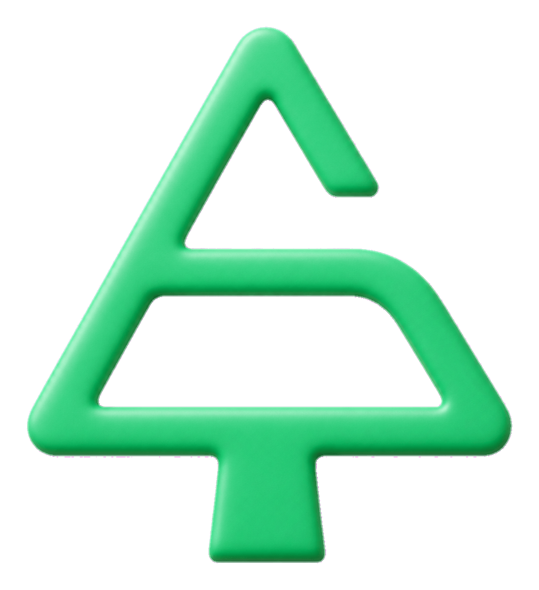
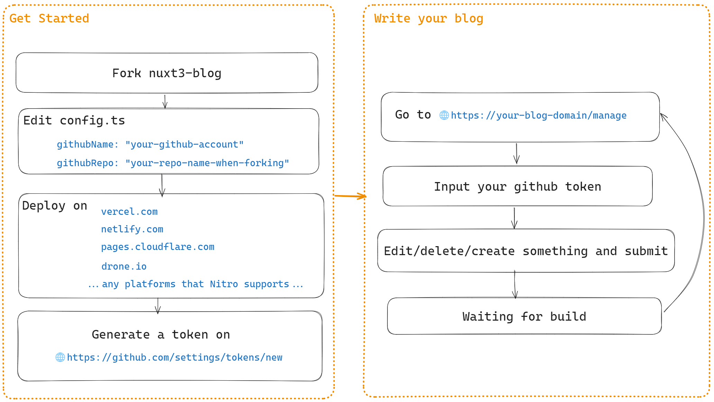

<p align="center">

</p>
<h1 align="center">💎Nuxt3-Blog</h1>

[](/LICENSE)  

[English Readme](/README.en.md) | 中文说明

**🚀已通过[NitroJS](https://nitro.unjs.io/)多平台部署（NitroJS是Nuxt3的[官方引擎](https://nuxt.com/docs/guide/concepts/server-engine)）**

> Vercel:[https://blog.yunyuyuan.net](https://blog.yunyuyuan.net)
>
> Cloudflare Page:[https://blog-cfpage.yunyuyuan.net](https://blog-cfpage.yunyuyuan.net)
>
> Netlify:[https://blog-netlify.yunyuyuan.net](https://blog-netlify.yunyuyuan.net)
>
> Github Pages:[https://blog-ghpage.yunyuyuan.net](https://blog-ghpage.yunyuyuan.net)
>
> **🚀self hosted部署（参考[我的文章](https://blog.yunyuyuan.net/articles/8346)）**
> Drone:[https://blog-drone-cf.yunyuyuan.net](https://blog-drone-cf.yunyuyuan.net)，这里的`cf`意思是使用cloudflare做内网穿透

# 博客特性

- 💻 **5分钟完成搭建**。快速搭建，不用写一行代码。
- 🤝 **方便使用**。全能的后台管理界面，只需一个token，就可**在网页端更新配置，新增/修改/删除博客内容**，不用`notepad`，更不用`git push`。
- 🌐 **纯静态**。打包为纯静态网站，无需后端。
- 🔍 **SEO友好**。每个HTML页面都是已经渲染完毕的，搜索引擎可收录。
- 🔌 **扩展性**。提供多个可选扩展功能，例如集成Cloudflare R2图床，展示实时浏览量，评论系统，全站搜索。
- 🔒 **可加密**。可以对任意单篇**文章/记录/文化**加密，也可以对某些内容单独加密，只有输入密码才可查看。

# 教我搭建

## 详细搭建教程请参考 [wiki](https://github.com/yunyuyuan/nuxt3-blog/wiki)

博客原理示例：

<center>

</center>

# 待开发

#### 特性

- [x] 404页面
- [x] 在本地`npm run dev`下更新数据
- [x] 自动化测试
- [x] 纯静态网站生成(SSG)
- [ ] 插件系统
- [x] 支持serverless function上传图片
- [x] 数据库集成(浏览量统计)
- [x] algolia全站搜索
- [x] 博客图片备份与迁移
- [x] 密码修改(目前仅支持在本地使用npm脚本修改)

#### 外观

- [x] 夜间模式
- [x] 国际化
- [ ] 多种布局主题(缺少UI设计)
- [x] 自定义主题色

##### 低优先级特性

- [ ] 不同加密页面可使用不同的密码
- [ ] 让monaco editor支持额外的markdown语法高亮
- [x] 一键拉取上游github仓库更新
- [ ] IV for AES encryption
- [x] 块级加密
- [x] SSR, 用于自建([参考](https://blog.yunyuyuan.net/articles/8346))
- [x] 支持 cloudflare page,netlify 以及其他服务

# 项目结构

- `/assets`
  - `/image` vite引入的图片
  - `/style` 公共/功能样式
- `/components` vue组件，被nuxt自动加载
- `/composables` vue响应式，被nuxt自动加载
- `/e2e` e2e测试
- `/i18n` 国际化翻译文件
- `/layouts` nuxt布局文件
- `/middleware` nuxt路由守卫
- `/pages` 所有网页视图
- `/plugins` nuxt插件
- `/public`
  - `/e2e/rebuild` 用于e2e测试的假数据
  - `/rebuild` 所有博客数据
  - `/sticker` 所有表情图片
- `/scripts` Gulp执行的脚本
- `/server` api服务器(Nodejs)
- `/utils`
  - `/api` `/server`调用的函数.
  - `/common` javascript相关的功能代码(不依赖vue或nuxt)
  - `/hooks` 一些composable封装逻辑
  - `/nuxt` nuxt相关的功能代码
- `/vite-plugins` vite插件
- `/config.ts` 博客配置，必须修改

# Node脚本

```json5
"scripts": {
  "build": "nuxt build", // 编译为ssr
  "dev": "nuxt dev", //开发
  "dev-for-test": "cross-env NUXT_PORT=13000 VITESTING=\"true\" nuxt dev", //用于e2e测试
  "build-for-test": "cross-env VITESTING=\"true\" nuxt build", //用于e2e测试
  "prod-for-test": "cross-env PORT=13000 node .output/server/index.mjs", //用于e2e测试
  "generate": "nuxt generate", // 弃用了
  "local:change-pwd": "gulp change-passwd", // 全局修改密码
  "local:generate-file-map": "gulp generate-file-map", // 收集全站图片，输出到file-map.json
  "local:download-file": "gulp download-file", // 读取file-map.json，下载所有图片到files/
  "local:substitute-file": "gulp substitute-file", // 读取file-map.json，替换为新的图片（运行此脚本前，请先修改file-map.json里的newUrl为需要替换的url）
  "local:upload-algolia": "gulp upload-algolia", // 上传所有索引到algolia
  "test:unit": "vitest run --exclude ./e2e", // unit测试
  "test:e2e": "vitest run --dir ./e2e", // e2e测试
  "test:dev-and-e2e": "start-server-and-test dev-for-test http://localhost:13000 test:e2e", // 运行测试dev并开始e2e测试
  "test:prod-and-e2e": "start-server-and-test prod-for-test http://localhost:13000 test:e2e", // 运行测试prod并开始e2e测试
  "eslint": "eslint --fix .", //执行eslint
  "preview": "nuxt preview", // 预览编译后的网站
  "prepare": "husky" // 安装husky
}
```

# 更新日志

[CHANGELOG.md](/CHANGELOG.md)

# 其他

- 技术解答/交流qq群：745105612
- 邮箱：me@yunyuyuan.net
- discord: https://discord.gg/HtSehSMYXa
