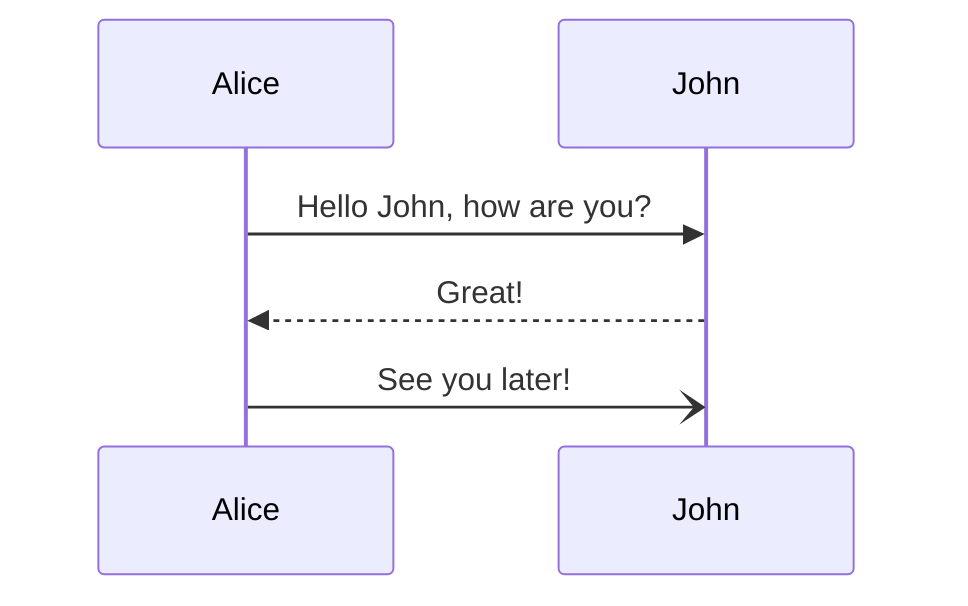

# Base
#[https:\/\/github.github.com/gfm/](https://github.github.com/gfm/)
::: details github flavored markdown
[html]<iframe src="https://github.github.com/gfm/" style="width: 100%;height: 80vh;" framespacing="0"></iframe>[/html]
:::

# Main Heading (H1)

## Secondary Heading (H2)

### Third Level Heading (H3)

#### Fourth Level Heading (H4)

##### Fifth Level Heading (H5)

###### Sixth Level Heading (H6)

## Basic Formatting

**Bold text** and *italic text*

***Bold and italic text***

~~Strikethrough text~~

> Blockquote text
> 
> Multiple paragraph blockquote

## Lists

### Unordered Lists
- Item 1
- Item 2
  - Subitem 2.1
  - Subitem 2.2
- Item 3

### Ordered Lists
1. First item
2. Second item
   1. Subitem 2.1
   2. Subitem 2.2
3. Third item

## Code

Inline code: `var example = "hello";`

Code block with syntax highlighting:

```javascript
function helloWorld() {
  console.log("Hello, world!");
  return true;
}
```

## Links and Images

[Link to GitHub](https://github.com)


## Tables

| Header 1 | Header 2 | Header 3 |
|----------|----------|----------|
| Cell 1   | Cell 2   | Cell 3   |
| Cell 4   | Cell 5   | Cell 6   |
| Cell 7   | Cell 8   | Cell 9   |

## Task Lists

- [x] Completed task
- [ ] Incomplete task
- [ ] Another task

## Horizontal Rule

---

## Escaping Characters

\*This text is surrounded by asterisks but is not italic\*

## HTML in Markdown

<details>
<summary>Click to expand</summary>
This is hidden content that can be expanded.
</details>

---
# ↑ End GFM ↑
---

# Additions
## 1. sticker


## 2. images with specific dimension
![favicon with `10rem` width and `unset` height[10rem x ]](/favicon.png)
![favicon with `50%` width and `100px` height[50% x 100px]](/favicon.png)

## 3. paragraph indents
<<>>Indent of paragraph start.

## 4. link with opening in new window
#[google](https://google.com)

## 5. text with color
-(gray: gray text)-
-(#ff0000: red **bold**)-


## 6. text with underline
_(underline *italic*)_
-(red: _(red underline *italic*)_)-

## 7. embed youtube video
[youtube][test youtube video](https://www.youtube.com/embed/LXb3EKWsInQ)[/youtube]

## 8. embed bilibili video
[bili][test bilibili video](https://player.bilibili.com/player.html?aid=626357031&bvid=BV1yt4y1Q7SS&cid=210738676&page=1)[/bili]

## 9. raw html
[html]<del>text</del>[/html]

## 10. fieldset
--title--
```js
const s = 123;
```
-- --

## 11. encrypted block
[encrypt]
will be encrypted during uploading
[/encrypt]

## 12. container block
::: info
some text
:::
::: tip custom title
--inside--
inside block-level element
-- --
:::
::: warning
some text
:::
::: danger
some text
:::
::: details hidden content
[encrypt]
will be encrypted during uploading
[/encrypt]
:::

## 13. embed video/audio
[video][big buck bunny](https://sw-oss.yunyuyuan.net/bigbuckbunny.mp4)[/video]
[video][with poster](https://sw-oss.yunyuyuan.net/bigbuckbunny.jpg|https://sw-oss.yunyuyuan.net/bigbuckbunny.mp4)[/video]
[audio][奥里给](https://sw-oss.yunyuyuan.net/aoligei.mp3)[/audio]

## 14. mathematic formula
* inline level $$F(n) = F(n-1) + F(n-2)$$ formula.
* block level:
$$
F(n) = \begin{cases}
  0, & \text{if } n = 0 \\
  1, & \text{if } n = 1 \\
  F(n-1) + F(n-2), & \text{if } n > 1
\end{cases}
$$

## 15. text with mask

[!you found me you found me you found me you found me you found me you found me you found me you found me you found me you found me you found me you found me !]

[!*and me*!]

## 16. mermaid diagram
#[please check reference](https://mermaid.js.org/)


# More
coming...