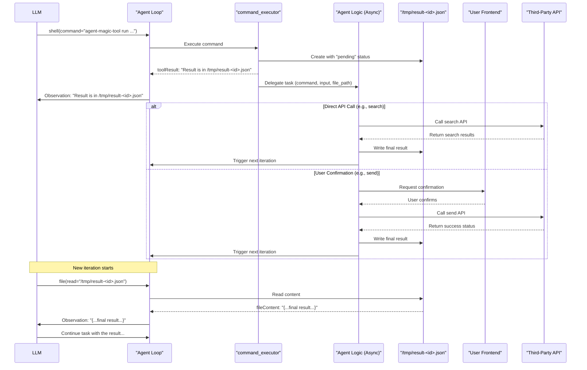

## 问题来源

<<>>在典型的AI Agent系统中，其工作流程是一个迭代循环(#[AI Agent参考](https://cdn.openai.com/business-guides-and-resources/a-practical-guide-to-building-agents.pdf))：LLM根据任务需求选择并调用一个工具，观察返回结果，然后基于新信息进行下一步思考和决策。
<<>>随着一个AI Agent的功能(tools)越来越多，便会出现**上下文压力**：每一个工具的定义（包括其名称、功能描述、参数列表和格式）都需要在输入（Prompt）中详细说明，以便LLM能够理解和使用。当集成的工具从几个增加到几十甚至上百个时，新增的tool可能会影响现有的已经调优好的tool。

## 思路：统一的CLI工具

<<>>设计一种基于现有`command_executor`（假设我们的AI Agent具有执行shell命令的工具）的扩展方案。该方案引入一个名为`agent-magic-tool`的"虚拟"命令行工具，将所有第三方集成功能收敛到其子命令中。

### 1. 概要

<<>>我们将原本需要定义为独立Tool Call的各项功能（如`gmail_search_messages`）全部改造为`agent-magic-tool`的子命令。这样，LLM的工具列表中不再包含五花八门的第三方工具，而主要是这个高度统一的cli。LLM通过执行不同的`agent-magic-tool`命令来完成多样化的任务。

<<>>这种设计的关键优势在于，LLM无需在上下文中加载所有工具的完整定义。它只需要知道`agent-magic-tool`的存在以及如何通过它来发现和执行具体的功能即可。

### 2. 工作流程详解

<<>>整个工作流程分为三个关键步骤：工具发现、Agent接管与执行、任务处理与迭代触发。下面我们以一个“在Gmail中搜索特定标签的邮件”的任务为例进行说明。

#### 步骤一：工具发现

<<>>当Agent需要执行某项功能时，它首先可以调用`agent-magic-tool`的帮助或列表命令来动态发现可用的工具及其用法。

```bash
agent-magic-tool list tools --query="gmail"
```

<<>>`command_executor`在解析这个命令后，返回一个描述可用子工具的JSON对象。这个JSON详细定义了每个工具的输入参数和格式，为LLM提供了足够的信息来构建下一步的执行命令。

**示例JSON输出：**
```json
{
  "gmail_search_messages": {
    "description": "Searches for messages in Gmail based on a query and labels.",
    "input": {
      "type": "object",
      "properties": {
        "search_query": {
          "type": "string",
          "description": "The search query string."
        },
        "label": {
          "type": "string",
          "description": "The label to filter messages by."
        }
      },
      "required": ["search_query"]
    }
  }
}
```

#### 步骤二：Agent接管与执行

<<>>在理解了`gmail_search_messages`工具的用法后，LLM可以生成并执行具体的调用命令。例如LLM在某一次调用`command_executor`，并且给出如下输入：

```bash
agent-magic-tool run gmail_search_messages --input='{"search_query": "年度报告", "label": "work"}'
```

<<>>我们在这里的处理流程是整个设计的核心：

1.  **创建结果占位符**：`command_executor`识别出`agent-magic-tool`调用后，并不会直接执行任何脚本或者命令。它的首要职责是立即在文件系统中创建一个临时的结果文件（例如 `/tmp/result-12345.json`），并写入一个初始状态，如 `{"status": "pending", "message": "The tool execution has been delegated to the agent."}`。
2.  **返回文件路径**：`command_executor`的本次执行结果会立即返回给Agent，内容就是这个临时文件的路径以及实际的输入，如`{"tool": "gmail_search_messages", "input": {"search_query": "年度报告", "label": "work"}}`。
3.  **Agent逻辑接管**：核心的处理逻辑交由Agent来做（或者对应的sub agent）。

#### 步骤三：任务处理与迭代触发

<<>>Agent在接收到任务后，会根据子命令和参数决定下一步的行动。这种决策是上下文感知的，极具灵活性。

* **对于直接任务**（如`gmail_search_messages`）：Agent会直接调用相应的第三方API（如Gmail API）。在获取到API返回的数据后，它会将这个最终结果写入之前创建的占位符文件 `/tmp/result-12345.json` 中，覆盖原有的“pending”状态。
* **对于需要确认的任务**（如发送邮件）：Agent可能会暂停执行，并向前端应用发送一个请求，等待用户进行安全确认。一旦用户在界面上点击“确认”，前端将通知Agent。Agent随后执行API调用，并将结果写入结果文件。

<<>>最后，Agent会主动触发新一轮的迭代。整个流程对于LLM来说，只是**执行一个shell脚本 -> 脚本返回了一个result-12345.json**，它自然会选择使用文件读取工具来查看该文件的内容，从而获得任务的最终执行结果，实是妙哉。

### 3. 流程图

<<>>以下Mermaid流程图直观地展示了上述调用过程：



## 方案优势总结

<<>>该方案通过一个统一的CLI入口和执行机制，带来了多方面的显著优势：

| 优势 | 描述 |
| :--- | :--- |
| **可扩展性** | 新的第三方集成可以作为`agent-magic-tool`的子命令被轻松添加，无需修改LLM的核心工具定义。这使得Agent的能力可以无限扩展。 |
| **上下文优化** | 将数百个潜在的工具定义缩减为一个`command_executor`的定义，极大地节省了LLM的上下文空间，使其能更专注于任务逻辑本身。 |
| **灵活性** | 异步占位符机制优雅地处理了长耗时任务、网络延迟甚至需要用户介入的场景。Agent的迭代循环不会被阻塞，可以灵活应对各种异常情况。 |
| **关注点分离** | 该设计将“工具的发现和选择”（由LLM负责）与“工具的具体执行”（由后端Agent逻辑负责）清晰地分离开来，使得系统架构更清晰，更易于维护。 |

## 结
<<>>这篇文档是AI基于我的简要说明写出来的，还不错哦