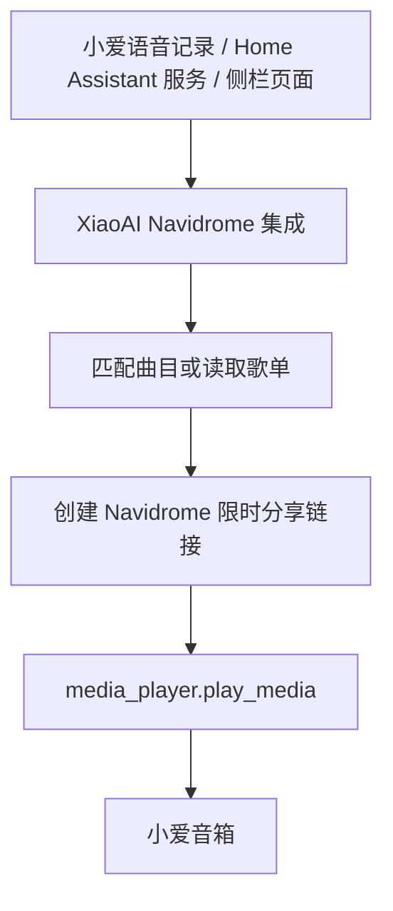

# 用 Home Assistant 让小爱音箱播放 Navidrome 音乐

<<>>最近买了个小爱音箱，想折腾一下放我之前无聊部署的Navidrome音乐。

<<>>Navidrome 负责管理曲库，Home Assistant 里也已经有小爱音箱的 `media_player` 实体。两边看起来都准备好了，但真正连起来还有几个问题：怎么把语音识别到的名称对应到曲库，怎么让音箱访问音频，怎么连续播放歌单，以及怎么让语音、网页和 Home Assistant 自动化操作同一份播放队列。

<<>>所以我vibe了一个 Home Assistant HACS 自定义集成：[1]。

<<>>简单来说，这个集成把 Navidrome 曲库接入 Home Assistant，再通过已有的 `media_player` 实体把音乐下发给小爱音箱。配置、曲库索引、播放队列、语音事件和侧栏页面都在 Home Assistant 内运行。


## 整体思路

整个播放流程并不复杂：



集成提供了三个操作入口：

| 入口 | 用途 |
| --- | --- |
| 小爱语音 | 播放单曲、播放歌单、上一首、下一首和停止 |
| Home Assistant 侧栏 | 浏览曲库、搜索、查看歌单和维护播放队列 |
| Home Assistant 原生服务 | 在自动化、脚本和开发者工具中控制播放 |

<<>>这三个入口并不是三套独立逻辑。它们使用同一份持久队列，所以从语音开始播放后，侧栏会立即显示当前曲目和完整队列；在侧栏里切到下一首，语音控制对应的也是新的位置。

## 音箱如何访问 Navidrome 音频

<<>>Subsonic 的普通串流地址通常会带上用户名、salt、token 和一串查询参数。我不希望把这些内容直接交给音箱，而且某些音箱对复杂 URL 的处理也不够稳定。

<<>>Navidrome 提供了分享功能。集成会通过 Navidrome API 为当前曲目创建限时 share，再从分享播放列表中取得 `/share/s/...` 形式的签名路径。最终下发给音箱的是一个没有查询参数、用户名和 Subsonic 凭据的 URL。Navidrome 的公开分享流也支持音频播放所需的 Range 请求。[2]

<<>>Home Assistant 访问 Navidrome 的地址和音箱访问音频的地址可以分开配置。例如 Home Assistant 可以通过局域网地址读取 API，而音箱使用一个能够访问 `/share/` 的 HTTPS 地址下载音乐。

<<>>集成会校验分享播放列表中的地址，只接受预期的 `/share/s/` 路径。队列被替换或清空后，不再使用的 share 也会被回收；即使临时删除失败，链接仍会在有效期结束后失效。

## Home Assistant 侧栏页面

<<>>安装完成后，Home Assistant 侧栏会出现一个音乐页面。这个页面由集成直接注册，使用当前 Home Assistant 登录会话调用后端 WebSocket 命令。[3]

<<>>页面默认打开歌单列表，也可以切换到曲目并搜索整个曲库。曲目和歌单都支持封面与详情，点击行为则尽量保持直接：

- 点击曲库中的曲目，会清空现有队列并立即播放该曲目。

- 点击歌单，会进入歌单详情。

- 点击歌单中的某一首，会把完整歌单加入队列，并从点击的曲目开始播放。

- 点击队列中的曲目，只会移动当前播放位置，不改变队列顺序。

<<>>播放器部分提供上一首、播放或暂停、下一首、清空队列和播放模式。播放模式可以在顺序循环、随机播放和单曲循环之间切换。进度、音量和静音控制则取决于当前 `media_player` 实体是否声明了对应能力，集成不会绕过 Home Assistant 实体本身的限制。[4]

<<>>页面支持日间、夜间和跟随 Home Assistant 三种主题。桌面端使用左右两栏，播放器和队列会停留在右侧；移动端则把播放器放到曲库上方，并用更紧凑的单列歌单列表。

<<>>封面不会直接从浏览器携带 Navidrome 凭据加载，而是经过 Home Assistant 鉴权代理。页面会根据实际显示尺寸请求缩略图，并在同一个 Home Assistant 浏览器页面中缓存已经加载的封面。从其他页面返回后，命中的封面不需要重新下载。

<<>>界面支持英语和简体中文，默认使用英语。语言只能在“设置 → 设备与服务 → XiaoAI Navidrome → 配置”中修改，页面本身没有额外的语言按钮。

## 语音点歌

<<>>如果米家集成提供了包含小爱语音识别结果的 conversation 传感器，可以在配置页面中选择它。之后集成会监听这个实体的状态变化，并识别下面几类口令：

```
播放家庭音乐<曲目名称><歌手名称>
播放家庭歌单<歌单名称>
上一首家庭音乐
下一首家庭音乐
停止家庭音乐
```

<<>>两个播放前缀都可以在集成配置中修改。传感器如果反复刷新同一条语音记录，集成会根据时间戳、conversation ID 或 sequence 去重，避免同一条命令被重复执行。

<<>>语音点歌的另一个问题是名称匹配。曲库中的标题不一定和说出来的内容完全一致，可能包含简繁体差异、大小写、日文假名或罗马字。

<<>>为了解决这个问题，集成会为曲目建立多组检索键，包括 Unicode NFKC、简繁转换、中文完整拼音、日文读音、平假名、片假名和罗马字，再结合字符距离进行排序。它不会生成拼音首字母，因为这种检索方式很容易让短词产生大量无关候选。

<<>>如果需要处理没有字符重合的跨语言表达，还可以配置 Ollama 或 OpenAI 兼容的 Embedding 接口。Embedding 只是额外的语义信号，不会覆盖明确的精确匹配；模型不可用时，普通词法匹配仍然可以继续工作。候选分数或第一、第二名的差距不足时，集成会拒绝自动播放，而不是随便选择一首。

## 队列与状态同步

<<>>播放队列保存在 Home Assistant 的 `.storage` 中。Home Assistant 重启后可以恢复队列内容和当前指针，但不会自行恢复播放。

<<>>自动切歌按照曲目时长工作，同时直接监听所选播放器的 `state_changed` 事件。[5] 如果音箱进入暂停、停止、待机或不可用状态，集成会取消当前的自动推进计时。Panel 中的播放状态、音量和进度也来自同一套 Home Assistant 状态事件。

<<>>每次队列修改都会携带 revision。假设一次语音匹配还在处理中，而用户已经暂停、清空或切换了队列，那么较晚返回的匹配结果不能覆盖新的操作。这个限制主要用来避免异步任务把已经改变的播放状态改回去。

<<>>队列支持的主要操作包括：

- 上一首、下一首、暂停、继续、停止和清空；

- 立即播放、插入下一首和追加到队尾；

- 顺序循环、随机播放和单曲循环；

- 选择输出播放器；

- 点击队列曲目直接跳转，但不改变队列顺序。

## 首页仪表盘控制

<<>>如果不想每次都打开侧栏页面，也可以直接使用 Home Assistant 原生卡片。

<<>>集成提供“快速播放歌单”选择实体。把它加入实体卡片后，可以从首页选择任意 Navidrome 歌单并立即播放。播放成功后，选择器会回到“播放歌单”，所以同一个歌单也可以连续选择多次。

<<>>上一首、暂停、继续和下一首则可以用普通按钮卡片调用这些服务：

```
xiaoai_navidrome.previous
xiaoai_navidrome.pause
xiaoai_navidrome.resume
xiaoai_navidrome.next
```

<<>>除此之外，还可以在自动化或脚本中调用 `xiaoai_navidrome.play`、`xiaoai_navidrome.play_playlist`、`xiaoai_navidrome.stop`、`xiaoai_navidrome.clear_queue` 和 `xiaoai_navidrome.sync_library`。

<<>>例如播放一首曲目：

```yaml
action: xiaoai_navidrome.play
data:
  query: "Synthetic Track Example Artist"
```

## 安装与配置

<<>>使用前需要满足下面几个条件：

| 组件 | 要求 |
| --- | --- |
| Home Assistant | 2026.8.0 或更高版本 |
| HACS | 已安装并可以添加自定义存储库 |
| Navidrome | 0.63.2 或更高版本，并启用分享功能 |
| 音频地址 | 小爱音箱可以访问 HTTPS 的 `/share/` 路径 |
| 播放实体 | 支持 `media_player.play_media`，并支持暂停或停止 |
| conversation 传感器 | 只有使用小爱语音控制时才需要 |

<<>>先在 HACS 中打开“集成 → 右上角菜单 → 自定义存储库”，添加：

```
https://github.com/yunyuyuan/ha-xiaoai-navidrome-bridge
```

<<>>类别选择 `Integration` 。下载完成并重启 Home Assistant 后，进入“设置 → 设备与服务 → 添加集成”，搜索 `XiaoAI Navidrome`。

<<>>配置分为两部分。第一部分填写 Navidrome API 地址、可选的对外分享地址、用户名和密码；第二部分选择输出播放器、conversation 传感器、语音前缀、页面语言和队列参数。

<<>>这里需要注意两个地址的区别：

- `Navidrome 地址` 是 Home Assistant 读取 API 的地址，可以使用 Home Assistant 实际能够访问的局域网地址。

- `Navidrome 对外分享地址` 是小爱音箱下载音乐的入口，需要能够访问 Navidrome 的 `/share/` 路径。

<<>>配置完成后，打开侧栏页面，选择输出音箱并同步一次曲库即可开始使用。Embedding 不是必需项，建议先确认普通搜索、分享链接和音箱播放都正常，再决定是否启用。

## 最后

<<>>这个项目要解决的问题其实很明确：让 Navidrome 继续负责音乐库，让 Home Assistant 负责设备、状态和自动化，再让小爱音箱只做最终的音频播放。

<<>>现在单曲、歌单、语音、侧栏和 Home Assistant 服务使用的是同一条播放链路。平时可以直接对小爱说话，也可以在 Home Assistant 中手动选择曲目；如果要加入自动化，则调用原生服务即可。

<<>>项目代码、安装说明和完整配置项都放在 GitHub：[1]。如果遇到问题，可以先下载 Home Assistant 中的集成诊断，再到仓库提交 Issue。诊断内容会过滤密码、API Key、曲目元数据、查询文本和语音记录。

---

<<>>人话：所有代码，包含这篇文章，都是vibe的

## References

[1]: https://github.com/yunyuyuan/ha-xiaoai-navidrome-bridge "XiaoAI Navidrome for Home Assistant"

[2]: https://www.navidrome.org/docs/usage/features/sharing/ "Navidrome Sharing"

[3]: https://developers.home-assistant.io/docs/frontend/custom-ui/creating-custom-panels/ "Home Assistant custom panels"

[4]: https://developers.home-assistant.io/docs/core/entity/media-player/ "Home Assistant media player entity features"

[5]: https://developers.home-assistant.io/docs/integration_listen_events/ "Home Assistant event subscriptions"